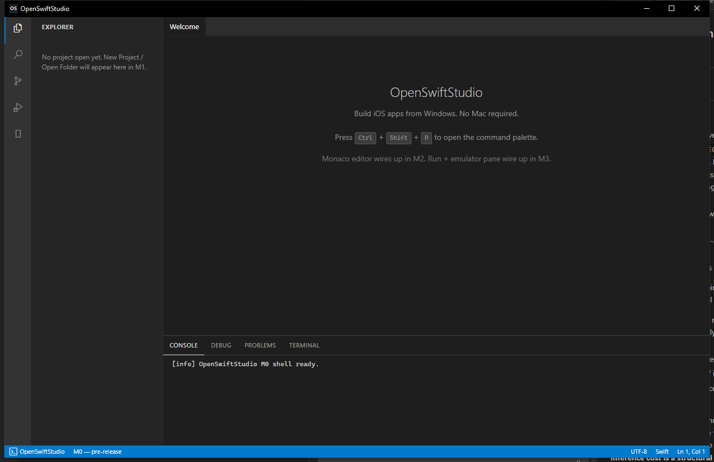

# OpenSwiftStudio

**Build iPhone apps from your Windows PC. No Mac required.**

OpenSwiftStudio is a free, open-source IDE that lets you write, run, and debug iOS apps on Windows — without owning a Mac, without paying for cloud services, without learning a new language. Just Swift, in a familiar VS Code-style editor, with a real iPhone emulator running right next to your code.

*The editor shell running on Windows 10 (M0 milestone). Monaco editor and the iPhone emulator pane land in later milestones.*

> ⚠️ **Early development.** OpenSwiftStudio is pre-release. Star the repo to follow along.

## Why

Apple's tools require a Mac. A Mac costs $1500+. For students, hobbyists, and developers in emerging markets, that's a wall — not a price tag, a wall. iOS development shouldn't be locked behind hardware most of the world can't afford.

OpenSwiftStudio removes the wall. Write Swift on your Windows laptop. See your app run in an iPhone-shaped window. Debug it. Ship it.

## Features

- **No Mac, no Xcode, no cloud rental** — the only standalone IDE that builds and deploys real iOS apps from Windows end-to-end
- **iPhone emulator on Windows** — your app runs in an iPhone-shaped window beside your code, with multiple device sizes (iPhone SE through 16 Pro Max + iPad), mouse-as-touch, and rotation
- **Real-device deploy over USB** — plug in any iPhone and run on hardware in seconds, no Mac in the loop
- **Full Swift language support** — autocomplete, inline errors, jump-to-definition, hover docs, and refactoring, powered by Apple's official `sourcekit-lsp`
- **VS Code-style editor** with dark theme, command palette, and familiar keybindings — zero learning curve if you already use VS Code
- **Real Swift debugger** with breakpoints, step-through, and variable inspection — the same LLDB that powers Xcode
- **Hot reload** on save — see UI changes instantly without rebuilding
- **Tiny footprint** — sub-20 MB binary, fast cold start, low memory
- **Free and open source** — Apache-2.0, no paid tier, no premium edition, no telemetry, no upsell

## Requirements

OpenSwiftStudio is built to run on any Windows PC that meets the minimums below. It needs no dedicated GPU and no special hardware — just enough CPU, RAM, and disk to run the Swift compiler and a WSL2 Linux distro alongside the editor.

**Operating system**
- Windows 10 version 1903 (build 18362) or newer, or Windows 11 — 64-bit
- 64-bit x86-64 processor (Intel or AMD). Windows on ARM is not supported yet.
- Hardware virtualization enabled in BIOS/UEFI. WSL2 (installed for you by the setup wizard) runs xtool, which processes the iOS SDK and deploys to real devices.

**Hardware — minimum / recommended**

| | Minimum | Recommended |
|---|---|---|
| Processor | 4-core x86-64 | 6-core or better (Swift builds are CPU-bound) |
| Memory | 8 GB RAM | 16 GB RAM |
| Storage | 20 GB free | 40 GB+ free on an SSD |
| Display | 1280x720 | 1080p or higher |

Storage covers the Swift toolchain, a WSL2 Linux distro, and the iOS SDK — the SDK is the largest piece and is downloaded during setup, never bundled by us.

**Accounts and extras**
- A free Apple ID — used only to download the iOS SDK from Apple and to sign apps for your own devices. Apple software is never bundled by us.
- A real iPhone is optional — only needed for testing on physical hardware over USB.

> These requirements are provisional while OpenSwiftStudio is in pre-release and may change before v0.1.

## Install

Pre-release builds will be available once v0.1 ships. Watch this repo or check back later.

## License

[Apache-2.0](LICENSE) — free for personal, educational, and commercial use.

## Not affiliated with Apple

OpenSwiftStudio is an independent open-source project. It is not affiliated with, endorsed by, or sponsored by Apple Inc. "iOS", "iPhone", "iPad", "Xcode", "Swift", "SwiftUI", and "UIKit" are trademarks of Apple Inc., used here in their descriptive sense to identify the platforms and frameworks the project targets.
